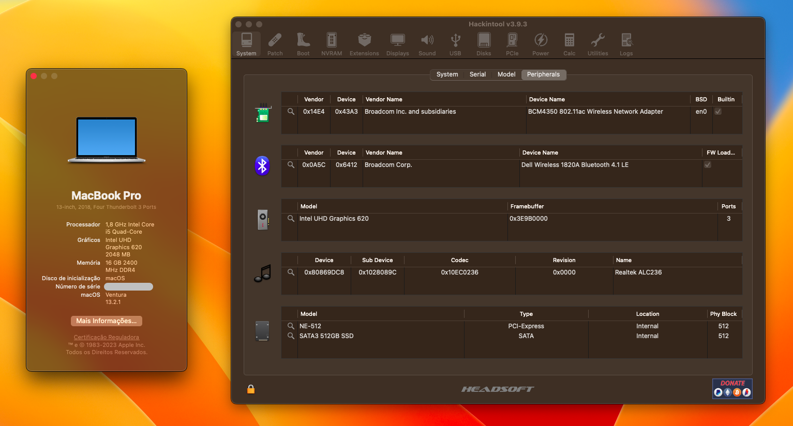
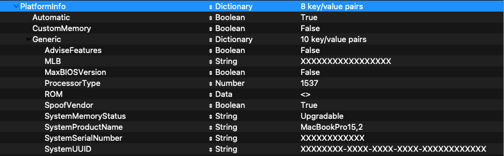

# EFI-DELL-INSPIRON-5480/LATITUDE-3400

:information_source: **The current version is fully macOS Monterey and Ventura compatible.**
OpenCore, drivers, and kexts are always up to date!

 

:warning: **DISCLAIMER:**
This is not a guide, please refer to [Dortania](https://dortania.github.io/getting-started/) before doing anything. I am not responsible for any damage. This OpenCore configuration is optimized for my specific hardware, so please use it only as a reference or if you happen to have the same or similar hardware.

## :computer: Hardware:

| **Category** | **Component**                          |
| ------------ | -------------------------------------  |
| **CPU**      | 1.8GHz Intel Core i5-8265u             |
| **GPU**      | Intel UHD 620                          |
| **RAM**      | 16GB 2400MHz DDR4                      |
| **SSD**      | 265GB NVMe SSD (Kingspec branded)      |
| **Display**  | 13,3" 1920x1080p LCD non-touch display |
| **Wi-Fi/BT** | Dell Wireless DW1820A                  |
| **Ethernet** | Realtek RTL8111                        |
| **Audio**    | Realtek ALC236 (layout-id=15)          |
| **Input**    | PS2 Keyboard & TrackPad                |

## :white_check_mark: Working:

- [x] CPU power management.
- [x] Graphics acceleration.
- [x] Battery read-out.
- [x] Keyboard & trackpad with all macOS gestures.
- [x] Wi-Fi.
- [x] Bluetooth.
- [x] USB ports.
- [x] Card Reader.
- [x] HDMI and DP(USB-C) video & audio output.
- [x] Ethernet.
- [x] Audio (Internal speakers, 3.5mm headphone jack).
- [x] Internal microphone.
- [x] 720p WebCam.
- [x] AirDrop & Handoff.
- [x] iCloud & App Store.
- [x] iMessage & FaceTime.

## :x: Not working:

--

## :closed_lock_with_key: SMBIOS

You will need to generate your own SMBIOS and configure, since is required to fully work with macOS. As per this [guide](https://dortania.github.io/OpenCore-Install-Guide/config-laptop.plist/kaby-lake.html#platforminfo) you can use the following SMBIOS: MacbookPro 14,1.

Use [GenSMBIOS](https://github.com/corpnewt/GenSMBIOS) to generate your own unique SMBIOS and then copy each parametter following path (recomended to follow the guide above):

- Config.plist -> PlatformInfo -> Generic

## Credits:

[**Acidanthera**](https://github.com/acidanthera)

[**Dortania**](https://dortania.github.io/getting-started/)